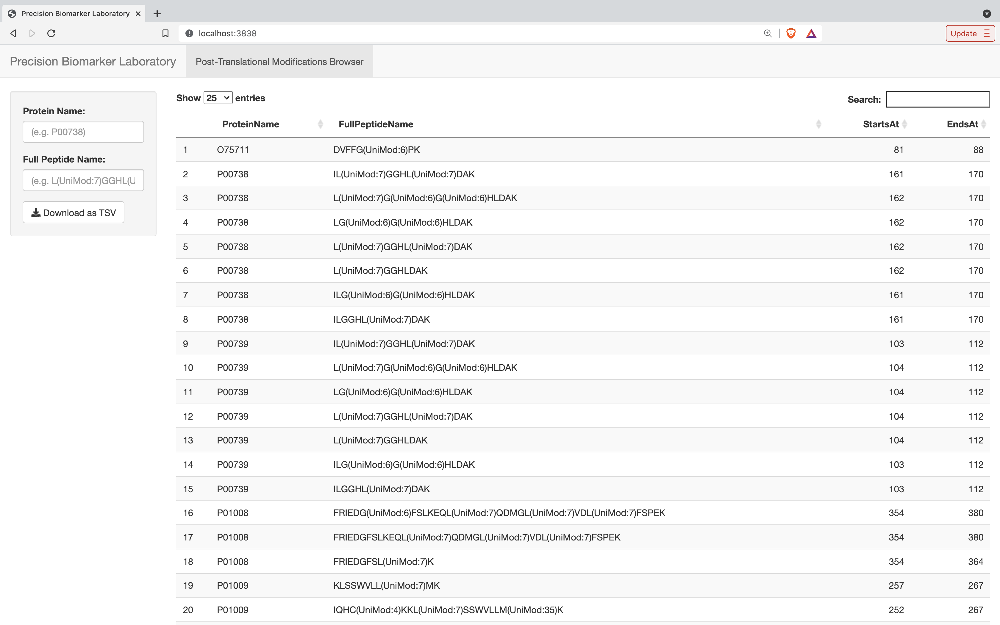

# Cedars-Sinai Data Developer Assignment

## 1. Quickstart

### 1.1 Running from Command Line Interface (CLI)

1. Make sure Python >= 3.7 and Git are pre-installed.

2. Clone this repository.

```
$ git clone git@github.com:liberaliscomputing/cedars-sinai-assignment.git
$ cd cedars-sinai-assignment
```

3. Create and activate a virtual environment. Install dependencies.

```
$ python3 -m venv venv && source venv/bin/activate
(venv) $ pip install --upgrade pip && pip install . -e
```

4. The above process installs a CLI tool `ptms-finder` on your local virtual environment. This tool now only supports a `find` function, requiring three arguments.

```
(venv) $ ptms-finder find -h
```

- INPUT_FILE_PATH: A path to an input file with a list of peptide sequences
- FASTA_FILE_PAT: A path to a fasta file with protein sequences
- OUTPUT_FILE_PATH: A path to an output file

5. On the root directory of the cloned repository, create a sub-directory (you can name it however you name). Put an input peptide sequence file and a FASTA protien sequence file under this sub-directory.

6. Run the following command (if the sub-directly is named `./files`).

```
(venv) $ ptms-finder find ./files/input.tsv ./files/proteins.fasta ./files
```

8. You can find `result.tsv` under the sub-directory.

### (Optional )1.2 Running a R Shiny Application

1. Make sure R is pre-installed and run the following command.

```
(venv) $ ./scripts/run_app.sh
```

2. An R Shiny web application rendering the created table is available at http://localhost:3838.


